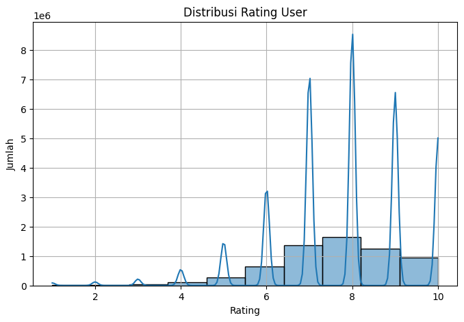
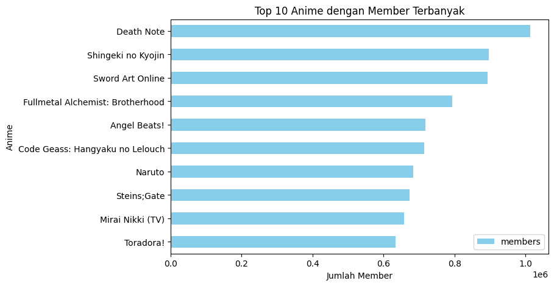
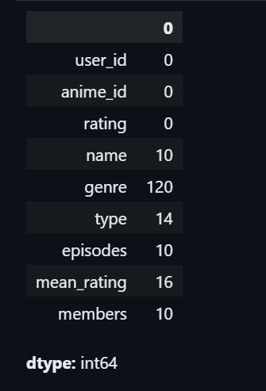
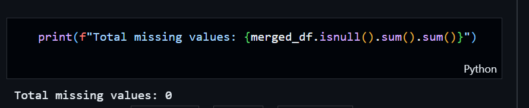
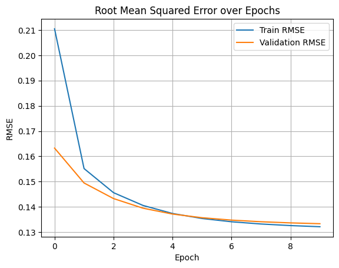
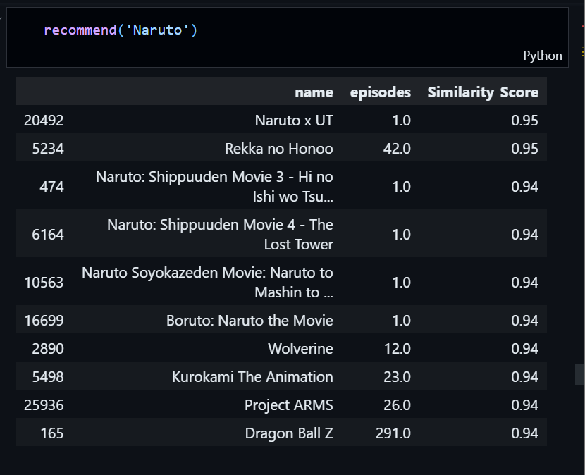
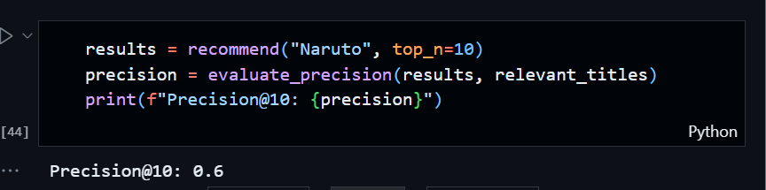
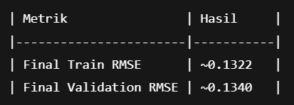
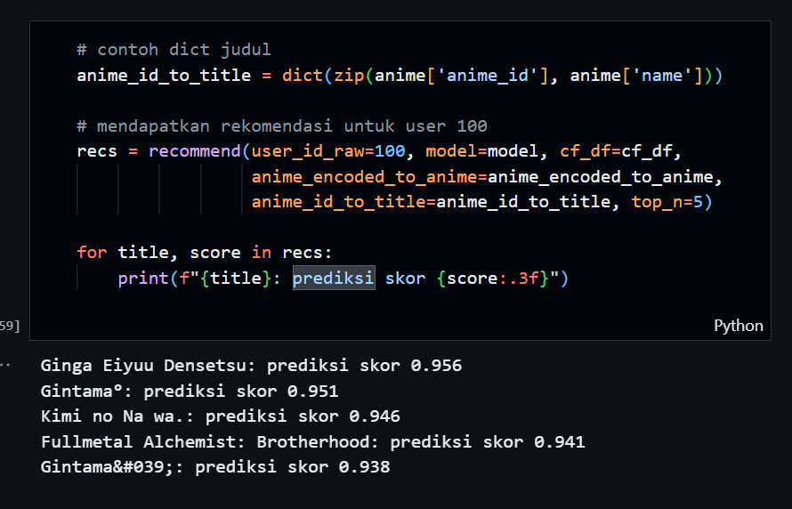

# Anime Recommendation System
Rekomendasi Sistem — Sistem Rekomendasi berbasis Content-Based Filtering & Collaborative Filtering

## Project Overview
Sistem rekomendasi telah menjadi komponen vital dalam berbagai platform digital, termasuk e-commerce, layanan streaming, dan komunitas daring. Dalam konteks hiburan seperti anime, pengguna dihadapkan pada ribuan judul dengan genre, tipe, dan episode yang beragam. Tanpa bantuan sistem penyaring, pengguna sering kali mengalami kesulitan dalam menemukan tontonan yang sesuai dengan preferensi mereka. Oleh karena itu, pengembangan anime recommender system menjadi penting untuk meningkatkan pengalaman pengguna melalui personalisasi.

Proyek ini secara khusus memanfaatan dua pendekatan utama dalam sistem rekomendasi, yaitu Content-Based Filtering (CBF) dan Collaborative Filtering (CF). Pendekatan CBF memungkinkan sistem untuk menyarankan anime yang mirip dengan yang sebelumnya disukai oleh pengguna berdasarkan fitur konten seperti genre. Sementara itu, CF memanfaatkan pola interaksi antar pengguna untuk memberikan rekomendasi yang lebih personal.

Relevansi dan urgensi proyek ini diperkuat oleh data dari platform MyAnimeList.net, di mana ribuan pengguna memberikan rating terhadap anime. Dataset tersebut yang telah dibagikan secara terbuka di Kaggle, digunakan dalam proyek ini. Penelitian sebelumnya juga menunjukkan bahwa sistem rekomendasi berbasis hybrid--gabungan antara CBF dan CF-- dapat meningkatkan akurasi dan kepuasan pengguna secara signifikan (Bobadilla et al., 2013; Aggarwal, 2016).

Dengan demikian, proyek ini tidak hanya relevan dalam konteks praktis dunia hiburan digital, tetapi juga mendemonstrasikan penerapan teknik machine learning dalam menyelesaikan masalah nyata di bidang personalisasi informasi.

## Business Understanding
### Problem Statements
- Pengguna kesulitan menemukan anime baru yang sesuai dengan preferensi mereka.
- Banyaknya judul anime membuat pengguna bingung memilih tontonan.

### Goals
- Mengembangkan sistem rekomendasi yang dapat memberikan top-N rekomendasi anime yang relevan.

### Solution Approach
- Content-Based Filtering <br>
Rekomendasi berdasarkan kemiripan fitur konten (genre, rating, dll) dari anime yang sudah disukai pengguna.
- Collaborative Filtering <br>
Rekomendasi berdasarkan interaksi user-user lain yang memiliki preferensi mirip.

## Data Understanding
- Dataset didapat dari Kaggle.
- Link Kaggle : https://www.kaggle.com/datasets/CooperUnion/anime-recommendations-database
- Dataset ini berisi preferensi pengguna terhadap anime, yang diambil dari MyAnimeList.net
- Terdiri dari dua file utama:
<br>

anime.csv - Metadata Anime :
- anime_id :	ID unik anime dari MyAnimeList
- name : Judul lengkap anime
- genre : Daftar genre (dipisah koma)
- type : Jenis tayangan (TV, Movie, OVA, dll)
- episodes : Jumlah episode (1 jika film)
- rating : Rata-rata rating komunitas (out of 10)
- members :	Jumlah member yang memiliki anime ini di daftar mereka
<br>

rating.csv - interaksi pengguna
- user_id : id acak pengguna
- anime_id : id anime yang dirating
- rating : rating pengguna
<br>

- Dataset `anime.csv` memiliki 12.294 baris, yang berarti terdapat 12.294 anime unik dan memiliki 7 kolom fitur.
- Dataset `rating.csv` memiliki 7.813.737 baris, artinya ada hampir 8 juta interaksi user terhadap anime dan memiliki 3 kolom fitur
<br>

Tipe data `anime.csv` <br>
Kolom yang bertipe numerik
- anime_id
- rating
- members
Kolom yang bertipe object
- name
- genre
- type
- episodes

<br>

Tipe data `rating.csv`<br>
Semua kolom bertipe data numerik (user_id, anime_id, rating)

### Univariate EDA
- Melakukan `describe()` di `anime.csv` dengan kesimpulan:
- Banyak anime yang belum dirating (rating<count)
- Rating komunitas rata-rata tinggi
- Penyebearan member sangat timpang

- Memfilter data yang valid (rating > 0) dan memvisualisasikanya untuk melihat distribusi rating user.<br>
<br>
**Insight**
User cenderung memberi rating tinggi, sehingga sistem harus hati-hati agar tidak menganggap semua anime bagus hanya karena rating tinggi.

- Visualisasi anime dengan members terbanyak <br>
<br>

- Melakukan `describe()` di `rating.csv`
Dengan insight yang didapat adalah data cenderung positif yang berarti user lebih sering memberi rating tinggi.

## Data Preprocessing
- Mengubah nama kolom rating di `anime.csv` menjadi `mean_rating`, agar tidak duplikat dengan nama kolom rating di `rating.csv`
- Menggabungkan dataset `rating.csv` dan `anime.csv` berdasarkan `anime_id`.
- Mengecek missing values <br>
 <br>
Masih banyak missing values di kolom name,genre, type, episodes, mean_rating dan members. Nanti akan kita handling dengan imputasi atau penghapusan.
- Mengecek data yang duplikat baik secara keseluruhan ataupun berdasarkan user_id dan name. Hasilnya untuk data keseluruhan terdapat 1 data yang duplikat dan untuk berdasarkan user_id dan name ada sekitar 9 data yang duplikat.

## Data Preparation
### Content-Based Filtering
- Menangani data yang duplikat dengan cara menghapusnya.
- Menangani missing values dengan cara menghapus `name` yang kosong, mengisi nilai kolom `genre` dan `type`, menghapus baris yang kolom `episodes` nya unknown, mengisi `mean_rating` dengan nilai mean, mengisi `members` dengan nilai median. <br>
 <br>
- Mengonversi kolom `episodes` menjadi float.
- Menggabung kolom `genre` dan `type` menjadi `content` agar sistem rekomendasi cbf dapat mengenali dan menghitung kemiripan antar anime dan karena TF-IDF Vectorizer bekerja berdasarkan teks, jadi semakin kaya kontennya, semakin baik model menangkap karakteristik tiap anime. Dengan `content` yang lengkap, sistem bisa merekomendasikan anime yang mirip secara genre dan format tayangan.
- Memfilter kolom yang tidak diperlukan. Untuk sistem ini, hanya kolom `name`, `episodes`, dan `content` yang digunakan dengan tujuan untuk memfokuskan sistem rekomendasi pada informasi yang paling relevan untuk analisis konten dan penyajian hasil.
- Setelah difilter, kita akan menghapus data duplikat lagi berdasarkan kolom `name`.

### Collaborative Filtering
- Menghapus rating yang dibawah 1, rating dibawah 1 menjelaskan bahwa user tidak melakukan rating untuk anime yang sudah selesai ditonton, dan itu tidak diperlukan di proses ini.
- Mengacak baris dataset (shuffling) dilakukan agar data train-val terdistribusi acak dan tidak terurut berdasarkan pola tertentu.
- Melakukan encoding user_id dan anime_id menjadi angka. Encoding ID penting karena model hanya bisa memahami input numerik, bukan string atau ID aslinya.
- Menyusun kamus pemetaan dibuat agar bisa mengubah kembali hasil prediksi ke label asli.
- Mengubah tipe data rating ke float, ini penting agar model bisa belajar dengan skala yang seragam dan mempercepat konvergensi.
- Normalisasi nilai rating ke skala 0–1 ini untuk membuat data dalam format yang dapat diproses oleh jaringan neural.
- Membagi dataset menjadi data pelatihan dan validasi, membantu evaluasi model dengan data yang tidak pernah dilihat selama training.

## Modelling
### Content-Based Filtering
Pendekatan CBF dalam proyek ini dilakukan dengan cara mengubah fitur `content` menjadi representasi numerik menggunakan teknik **TF-IDF (Term Frequency-Inverse Document Frequency)**. Fitur `content` terdiri dari informasi gabungan seperti genre, tipe, anime, dan rating, yang mencerminkan karakteristik dari setiap anime.

#### Langkah-langkah modelling
- Vektorisasi Teks dengan TF-IDF <br>
```
tfidf = TfidfVectorizer()
tfidf.fit(df_model['content'])
tfidf.get_feature_names_out()
```
Digunakan untuk mengukur pentingnya sebuah kata dalam dokumen relatif terhadap seluruh korpus. Ini mengurangi bobot kata-kata umum dan memperkuat kata-kata khas dalam deskripsi anime.

- Transformasi ke Bentuk Matriks <br>
```
tfidf_matrix.todense()
```
Matriks TF-IDF dikonversi ke bentuk densitas untuk mempermudahkan pemetaan ke DataFrame.

- Pembuatan DataFrame representasi TF-IDF.
```
tfidf_df = pd.DataFrame(
    tfidf_matrix.todense().round(2),
    columns=tfidf.get_feature_names_out(),
    index=df_model['name']
)
```
DataFrame ini akan menampilkan nilai TF-IDF tiap kata untuk setiap anime, memungkinkan analisis fitur yang lebih detail.

- Penghitungan kemiripan antar anime.
```
cosine_sim = cosine_similarity(tfidf_matrix)
```
Menggunakan cosine similarity untuk mengukur kemiripan antar anime berdasarkan representasi TF-IDF mereka.

- Fungsi Rekomendasi.
Fungsi ini menerima input berupa judul anime dan menghasilkan daftar top-N anime yang paling mirip berdasarkan skor kemiripan cosine.

### Collaborative Filtering
Model yang digunakan adalah model Collaborative Filtering berbasis Neural Network menggunakan framework TensorFlow dan Keras. Arsitektur model terdiri dari :
- Dua buah embedding layer untuk memetakan user_id dan anime_id ke vektor berdimensi 50.
- Hasil embedding digabungkan menggunakan dot product untuk menghasilkan skor prediksi.
- Model ebrsifat sederhana namun efektif untuk skenario skala besar seperti dataset anime ini.
<br>

Parameter yang digunakan :
| Komponen          | Nilai                           |
|-------------------|---------------------------------|
| Dimensi Embedding | 50                              |
| Fungsi Aktivasi   | Tidak digunakan (hanya dot product) |
| Loss Function     | Mean Squared Error (MSE)        |
| Optimizer         | Adam, learning_rate=0.001       |
| Regularizer       | L2 (lambda = 1e-6)              |

#### Training Model
Model dilatih selama 5 epoch dengan `batch_size = 4096` untuk mempersingkat waktu. Data dibagi menjadi 80% training dan 20% validation untuk mengevaluasi generalisasi model.

#### Visualisasi Kinerja
Hasil training divisualisasikan dalam bentuk grafik **Root Mean Squared Error (RMSE)** untuk data training dan validation per epoch. Dari grafik terlihat bahwa nilai RMSE menurun dan stabil, tanpa indikasi overfitting. <br>
 <br>

### Kekurangan dan Kelebihan CF dan CBF
| Metode                  | Kelebihan                                                                 | Kekurangan                                                                 |
|-------------------------|---------------------------------------------------------------------------|----------------------------------------------------------------------------|
| Collaborative Filtering | - Dapat memberikan rekomendasi yang sangat personal<br>- Tidak butuh metadata item | - Cold start problem (sulit merekomendasikan untuk user/item baru)<br>- Rentan terhadap sparsity data |
| Content-Based Filtering | - Bisa bekerja meskipun user/item baru<br>- Rekomendasi berbasis fitur item | - Kurang variatif karena cenderung merekomendasikan item yang mirip<br>- Butuh data deskriptif (fitur) item yang lengkap |

## Evaluasi
### Metode Evaluasi CBF
- Precision@10, untuk mengevaluasi kualitas 10 rekomendasi teratas terhadap anime yang dianggap relevan.<br>


- Hasil Evaluasi <br>
 <br>
Precision@10 sebesar 0.6 berarti dari 10 anime yang direkomendasikan untuk pengguna yang menyukai "Naruto", sebanyak 6 di antaranya benar-benar relevan.

### Metode Evaluasi CF
- RMSE (Root Mean Squared Error) untuk mengukur selisih antara rating yang diprediksi dan rating asli.
- Formula RMSE
```
RMSE = sqrt( (1/n) * Σ (y_i - ŷ_i)² )
```
- Hasil Evaluasi <br>


RMSE yang rendah menunjukkan prediksi model sangat mendekati rating sebenarnya. <br>

 <br>

- Ini menunjukkan sistem sudah cukup baik dalam mengenali kesamaan preferensi pengguna terhadap konten.

## Kesimpulan
Proyek ini berhasil membangun sistem rekomendasi anime menggunakan dua pendekatan utama, yaitu Content-Based Filtering (CBF) dan Collaborative Filtering (CF). Dengan memanfaatkan dataset dari MyAnimeList.net, sistem ini mampu memberikan rekomendasi anime yang relevan berdasarkan preferensi pengguna sebelumnya maupun pola interaksi dari pengguna lain yang serupa.

Melalui teknik TF-IDF dan cosine similarity, pendekatan CBF memungkinkan sistem memahami kemiripan konten antar anime. Di sisi lain, CF berbasis matriks rating pengguna memungkinkan sistem untuk mempelajari pola preferensi yang lebih dalam dan personal. Evaluasi model menggunakan metrik RMSE menunjukkan performa model dalam memprediksi rating yang mendekati nilai aktual.

Secara keseluruhan, sistem ini membuktikan bahwa integrasi pendekatan konten dan kolaboratif dapat meningkatkan kualitas rekomendasi, sekaligus memberikan pengalaman pengguna yang lebih baik dalam menjelajahi ribuan judul anime. Proyek ini juga menjadi contoh penerapan nyata machine learning dalam dunia hiburan digital yang relevan dan bermanfaat.

## References
Bobadilla, J., Ortega, F., Hernando, A., & Gutiérrez, A. (2013).
Recommender Systems Survey. Knowledge-Based Systems, 46, 109–132.